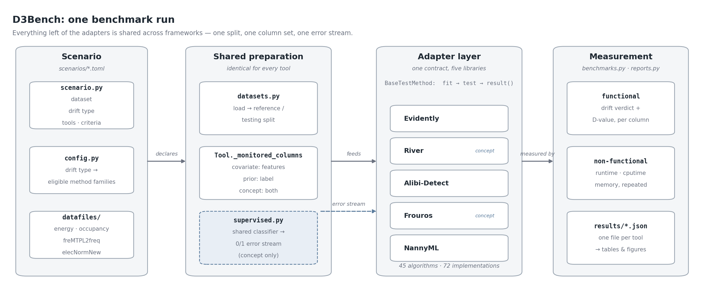

# D3Bench: Benchmarking Open Source Tools for Dataset Drift Detection

D3Bench compares open-source drift detection frameworks on common ground: the same
data splits, the same monitored columns, and the same measurements, so that differences
in the results are differences between *detectors* rather than between the ways they
happen to be called.

It began as the code accompanying
[Open-Source Drift Detection Tools in Action: Insights from Two Use Cases](https://arxiv.org/abs/2404.18673)
and has since been extended into the benchmark behind the survey *Drift Detection
Frameworks: A Survey and Reproducible Benchmark*: declarative scenarios, all three drift
types, a supervised concept-drift path, and per-method result records.

**Frameworks compared:** **Evidently**, **River**, **Alibi-Detect**, **Frouros**, **NannyML**
— 45 distinct algorithms across 72 framework–method implementations.
(`Menelaus` and `TorchDrift` adapters exist but are excluded from the comparison:
unmaintained upstream, and registering one method and none respectively.)

**Comparison criteria:**

* **Functional suitability** — does the detector flag drift, and on what statistic (the `functional` and `statistics` criteria).
* **Runtime and resource usage** — wall-clock, CPU time and peak memory per detector (`runtime`, `cputime`, `memory`).
* **Flexibility** — continuous, categorical and mixed-type data; univariate and multivariate; batch and streaming.
* **Integration capabilities** — usable inside an MLOps pipeline.
* **Usability** — API uniformity and the effort of writing a common adapter.

## Setup

```shell
python3 -m venv venv
source venv/bin/activate
pip3 install --upgrade pip setuptools

# d3bench plus all five drift detection libraries
pip3 install -e ".[full]"
```

For the core package alone (e.g. to add a tool or work on the CLI), without pulling in
every detection library:

```shell
pip3 install -e .
```

Tested with Python 3.11 and Evidently 0.7.21, NannyML 0.13.0, Alibi-Detect 0.13.0,
Frouros 0.9.0, River 0.23.0 (pinned in `pyproject.toml`).

## Scenarios

A **scenario** is a declarative TOML file naming the dataset, the drift type, and the
tools and criteria to run. The drift type alone determines which method families are
eligible and which columns are monitored, so no per-tool configuration is involved.

| Scenario (`scenarios/*.toml`) | Dataset | Drift type | Splits (ref / test) |
| --- | --- | --- | --- |
| `energy_covariate` | Smart-building energy | covariate | 35,088 / 70,052 |
| `occupancy_covariate` | Building occupancy | covariate | 16,091 / 30,464 |
| `french_motor_covariate` | freMTPL2freq, split by `Region` | covariate | 513,946 / 164,067 |
| `french_motor_prior` | freMTPL2freq, label resampled | prior | 339,006 / 113,160 |
| `elec2_concept` | Electricity (Elec2) | concept | 31,718 / 13,594 |
| `elec2_injected_concept` | Elec2 + injected P(y\|X) flip | concept | 19,171 / 8,217 |

A covariate scenario monitors the feature columns, a prior scenario narrows to the label
alone, and a concept scenario trains one shared classifier on the reference split and
streams its 0/1 misclassification sequence to every detector (`d3bench.supervised`), so
concept-drift detectors are compared on an identical error signal.

## Usage

Run a scenario exactly as configured in its TOML:

```shell
python3 -m d3bench --scenario scenarios/french_motor_prior.toml
```

Narrow a run — **set-valued flags take a comma-separated list** (not space-separated) and
override the scenario's own `[run]` values:

```shell
python3 -m d3bench --scenario scenarios/elec2_concept.toml \
    --tools Frouros,River --criteria functional,statistics
```

A scenario is the supported entry point: it is what fixes the split, the monitored
columns and the eligible method families, and therefore what makes two frameworks'
numbers comparable. (`--datafile` selects a dataset with fixed defaults instead of a
scenario; that path currently raises a `TypeError` and is not usable.)

All options:

```shell
python3 -m d3bench --help
```

Each run writes one JSON file per tool under `results/`, holding a per-method,
per-column record: the drift verdict, the statistic behind it (the "D-value"), the
effective sample size actually scored, the first-firing offset for streaming detectors,
and the timing/memory statistics.

## Structure



* **src/d3bench** — the installable package.
  * **config.py** — available frameworks, datasets and criteria; which method families each drift type resolves to.
  * **scenario.py** — parses a scenario TOML and runs it end to end.
  * **datasets.py** — `Dataset` classes binding a datafile, its preprocessing and its reference/testing split.
  * **methods.py** — the method taxonomy: one `StrEnum` per family (online/batch × concept/data), giving every framework a shared identifier for the same algorithm.
  * **tools/** — the `Tool` base class and one adapter module per framework. Each maps its library's detectors onto the shared `fit` / `test` / `result` contract.
  * **supervised.py** — the shared classifier for concept-drift scenarios and its 0/1 error stream.
  * **benchmarks.py** — executes one detector and measures it; **results.py** / **reports.py** collect and serialise the records.
  * **\_\_main\_\_.py** — CLI entry point.
* **scenarios** — the scenario TOML files listed above.
* **datafiles** — `energy`, `occupancy`, `motor` / `motor_prior` (freMTPL2freq), `elec2` (`elecNormNew.arff`).
* **results** — result JSONs, plus the generators that turn them into the paper's tables and figures (`make_french_motor_tables.py`, `make_elec2_tables.py`, `generate_nonfunctional_figure.py`) and notebooks that visualise them.
<!-- * **scripts** — analysis notebooks and figure generators, including the six `elec2_*` notebooks backing the Elec2 analysis and `framework_feature_comparison.ipynb`, which introspects the adapter registry to produce the per-framework capability tables. -->

## Reproducing and confirming results

Run every scenario:

```shell
for s in scenarios/*.toml; do python3 -m d3bench --scenario "$s"; done
```

Re-running is not required to rebuild the tables and figures — the generators under
`results/` read the stored JSONs directly. Note that each writes to the output directory
set by the `OUT_DIR` / `OUTPUT_PATH` constant at the top of the script.

Individual claims can be checked in a single command. Split sizes, monitored-feature
counts and target columns come straight from the scenario definitions:

```shell
python -c "
import glob, pathlib
from d3bench.scenario import Scenario
for p in sorted(glob.glob('scenarios/*.toml')):
    d = Scenario.from_toml(p).load_dataset().split_data()
    print(f'{pathlib.Path(p).stem:24} ref={len(d.reference):>7,} test={len(d.testing):>7,}'
          f' feat={len(d.features)} target={d.target}')"
```

The Elec2 concept-drift finding:

```shell
python -c "
from d3bench.scenario import Scenario
from d3bench.supervised import error_stream
d = Scenario.from_toml('scenarios/elec2_concept.toml').load_dataset().split_data()
es = error_stream(d); t = es.testing; h = len(t) // 2
print(f'reference (out-of-fold) = {es.reference.mean():.3f}   testing stream = {t.mean():.3f}')
print(f'first half = {t[:h].mean():.3f}   second half = {t[h:].mean():.3f}')"
# reference (out-of-fold) = 0.251   testing stream = 0.258
# first half = 0.316   second half = 0.199
```

Method coverage can be verified against the upstream libraries without running the
benchmark at all, which guards against a capability claim going stale as they evolve:

```shell
# NannyML: method -> supported feature types
python -c "from nannyml.drift.univariate.methods import MethodFactory; [print(name, '->', [str(k) for k in per_type]) for name, per_type in sorted(MethodFactory.registry.items())]"

# Frouros: data-drift and concept-drift detectors
python -c "from frouros.detectors import data_drift, concept_drift; print(sorted(n for n in dir(data_drift) if n[0].isupper())); print(sorted(n for n in dir(concept_drift) if n[0].isupper() and not n.endswith('Config')))"

# River: unsupervised detectors, then the binary (error-stream) detectors
python -c "from river import drift; print(sorted(n for n in dir(drift) if n[0].isupper())); print(sorted(n for n in dir(drift.binary) if n[0].isupper()))"

# Alibi-Detect: drift detectors
python -c "from alibi_detect import cd; print(sorted(n for n in dir(cd) if n.endswith('Drift')))"
```

Two differences between those listings and the benchmark's own coverage are deliberate.
Detectors requiring a user-supplied model or kernel (Alibi-Detect's `ClassifierDrift`,
`LearnedKernelDrift`, `SpotTheDiffDrift`) are registered but disabled, since running them
would benchmark the supplied model rather than the detector. So are detectors whose
preconditions no real scenario satisfies: Evidently's `fisher_exact` requires the two
splits to have equal length, and its `g_test` equal category totals, neither of which
holds for reference and testing splits of different sizes.

## License

Apache License 2.0 — see [LICENSE](LICENSE).
